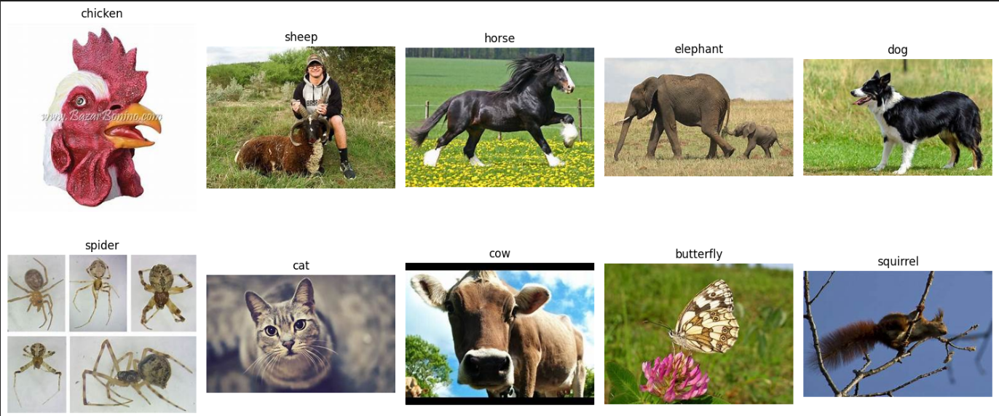
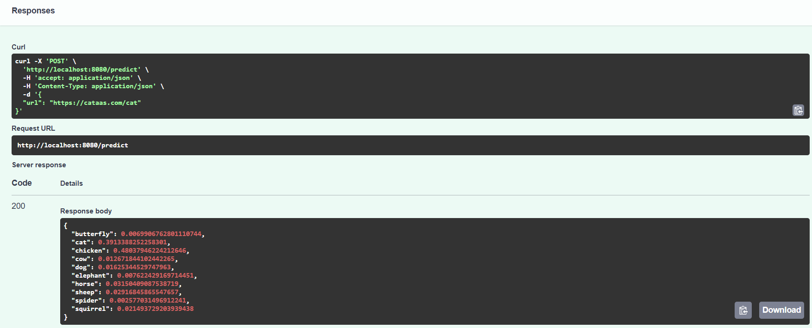
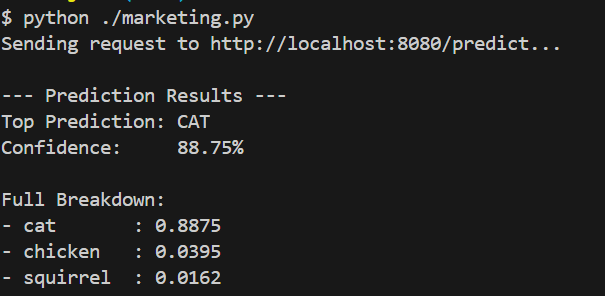

# Animal Classification System

## Description

### Problem Statement

The goal of this project is to build a robust classifier that can handle real-world images of animals.
With this system, it can helps a lot in providing teaching assistant, or scientific work

### Solution Approach

This project implements a machine learning pipeline:
1. Animal Classification: Using CNNs model
2. Deployment: Deploy a web service for education or scientific work

## Instruction on How to Run Project

### Preparing the dataset:

1. Go to the dataset link on Kaggle: https://www.kaggle.com/datasets/alessiocorrado99/
2. Create a notebook and run the code including in subset.ipynb to have a small subset of that dataset

Run the code 3 times for train, validation, test parts (all in data folder)
*If you don't want to start from scratch I also included it in the data folder*

### EDA:

We can see there are 10 categories of animals with a lot of variation:

### Model Training:

There are 2 files:
- notebookOtherModel.ipynb: Train and Tuning for Logistic Regression (C) and Random Forest (n_estimators, max_depth, min_sample_leafs) 
- notebookwithCNN.ipynb: Train and Tuning for CNNs (learning rate, dropout rate, size of the inner layer)

### train.py:

Run it: ```python train.py```
Model saved to ```animal_model.pth```

### predict.py:

Load the model instantiate web API using FastAPI

### marketing.py:

Send the requests to API and then receive the prediction

### Run it:

Requirements: kubectl, kind, uv

`kind create cluster --name animalclassification`

_Building FastAPI Service:_

`uv init`

`rm main.py`

_Add Dependencies:_

`uv add fastapi uvicorn onnxruntime keras-image-helper numpy torch torchvision requests`

_Test Locally:_

`uv run uvicorn predict:app --host 0.0.0.0 --port 8080 --reload`

Open http://localhost:8080/docs to see the API documentation.

_Docker Containerization:_

Create the Dockerfile (use given) and build: `docker build -t animal-classifier .`

Run it: `docker run -it --rm -p 8080:8080 animal-classifier`

In another terminal test: `python marketing.py`

_Loading image to Kind:_ `kind load docker-image animal-classifier --name animalclassification`

### Deployment:

Create folder for all config files:

`mkdir k8s`

`cd k8s`

Create deployment.yaml, service.yaml: (in k8s folder)

Deploy it:

`kubectl apply -f deployment.yaml`

`kubectl apply -f service.yaml`

Checking:

`kubectl get deployments`

`kubectl get services`

_Testing Deployed Service:_

`kubectl port-forward service/animal-classifier-service 8080:80`

So now we can use it: 

Go to the http://localhost:8080/docs#/default/predict_predict_post

- Replace the string with the link https://cataas.com/cat (URL for cat images)

=> the responses: 

- or using `python marketing.py`

=> 


